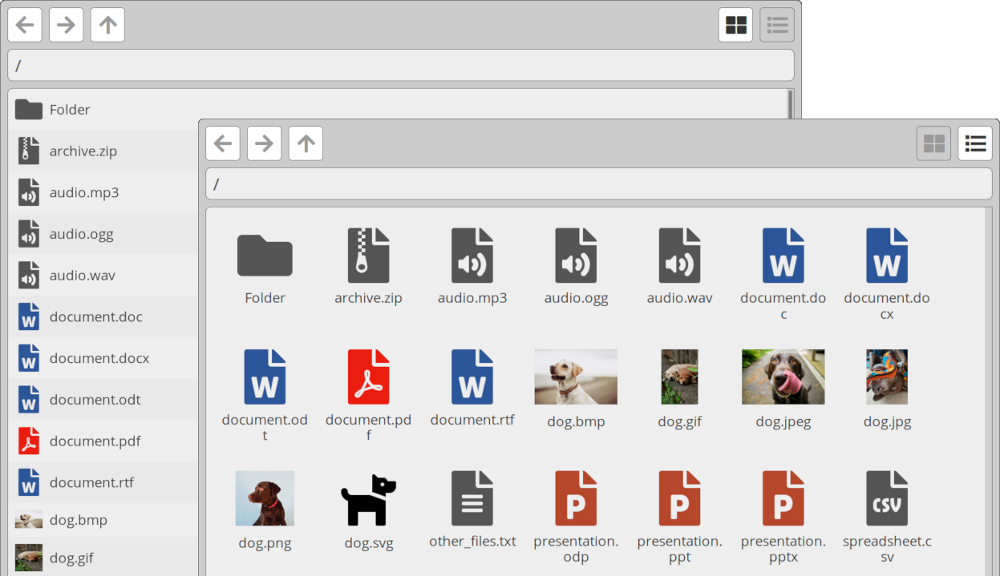

# Grav File Browser Plugin

The **File Browser plugin** for [Grav](http://github.com/getgrav/grav) is a highly-configurable solution for providing visitors with a file browser/directory listing.



## Installation

The preferred method of installation is via the GPM, which makes it easy to keep the plugin up-to-date.

```
$ bin/gpm install file-browser
```

### Manual installation

Alternatively, you can download the zip version of this repository, unzip to `/your/site/grav/user/plugins` and rename directory to `file-browser`.

## Usage

To use this plugin, you need to create a page that uses the `file_browser_plugin.html.twig` template, which is referred to as "File browser plugin" in the Grav Admin panel. This will produce a page with the file browser embedded for your visitors to be able to use.

File browser navigation is achieved via javascript, and views for all available folders exist as elements which are hidden via CSS. This gives a very immediate responsiveness to the file browser, and eliminates risk of code injection revealing files outside of those you have made available.

If you want to be able to list vast numbers of files and folder, you may want to look at alternative solutions, since in this approach, the size of your webpage will scale with the total number of files and folders.


## Configuration

By default, the plugin is configured to source files from `user://files`, which doesn't usually exist and will need to be created. Typically this will resolve to `user/files`, but if you're using a multi-site setup, it will resolve to `user/sites/{site-name}/files`. You can configure the directory to be anywhere that is accessible via your PHP/webserver setup.

### Options

- `enabled`: (bool) Plugin status.
- `built_in_css`: (bool) Whether to load the built-in CSS.
- `load_font_awesome`: (bool) Whether to load Font Awesome Free on the file browser page.
- `fa4_compatability`: (bool) Whether to set the prefix to `fa`.
- `source`: (text) URI for file directory (eg. `user://files`).
- `show_hidden_files`: (bool) Whether to show hidden files.
- `default_view`: (`tile`/`list`) Default view for the file browser.
- `base_to_extend`: (text) Twig template to extend (eg. `partials/base.html.twig`).

#### Font Awesome Pro

- `use_alt_arrows`: (bool) Whether to use `fa-arrow-alt-*` for navigation controls.
- `icon_weight`: (`fas`/`far`/`fal`) Font Awesome variant to use.


#### File sorting

- `sort_show`: (bool) Whether to use `fa-arrow-alt-*` for navigation controls.
- `sort_icon_asc`: (text) FA icon to use for sorting ascending (A->Z).
- `sort_icon_desc`: (text) FA icon to use for sorting descending (Z->A).

#### File icons

- `file_icon_default`: (text) Default icon to use for files.
- `show_thumbnails`: (bool) Whether to generate thumbnails.
- `thumbnail_types`: (text, comma separated) File types to generate thumbnails for.
- `file_specific_icons`: Whether to use specific icons for defined file types.
- `colourise_icons`: (bool) Whether to colourise specific icon types.
- `file_icon_types`: (list) Font Awesome icon: comma-separated list of extensions (eg. `fa-file-video: 'mp4, mov'`).


### Per-page configuration

All configuration options can be overridden on a per-page basis simply by adding the same keys to the template page under a key called `file_browser:`. For example:

```yaml
title: Raw Pages
file_browser:
  source: "user://pages"
```

This is mostly for people to be able to have multiple pages with browsers for different directories.


## To Do

- [ ] Build an admin panel for managing files.
- [ ] Make file-specific icon colouring configurable via the config file.
- [ ] Include template for modular pages.
- [ ] Implement shortcode insertion.
- [ ] Add support for sourcing files from outside of Grav.
- [ ] Translations: Please send me pull requests!

## License

MIT license. See [LICENSE](LICENSE)
